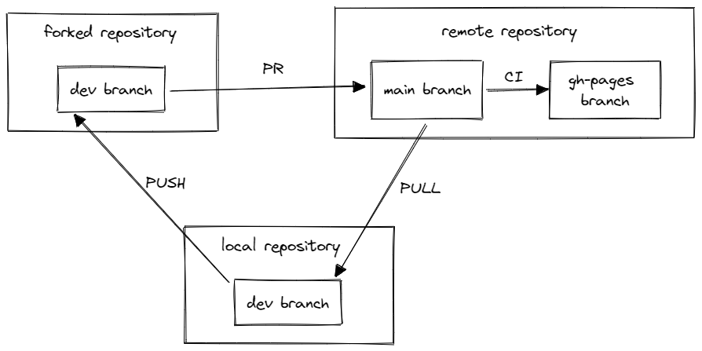
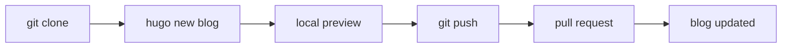
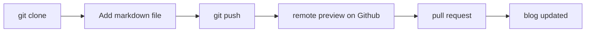



# Motivation

WAMR has a large amount of nice features, but we don't have a home to introduce these yet. A blog system would be a great choice, it will have such advantages:

- SEO friendly, which may attract more people to see our GitHub page
- Write freely, write everywhere. It's not a formal document and everyone can write something here
- Give us a knowledge base of the design from both Intel teams and external contributors
- Be the entrepot of our articles and we can forward to other social medias

## Blogging solution

I've spent a lot of time to decide which tool/framework to use in our blogging system since there are so many solutions. These major factors are taken into consideration:

1. Satisfy most people's writing habits
2. Full control of our data, don't rely on commercial storage service
3. No billing
4. Customizable, we can decide the layout and style of our blog

I investigated some modern blog tools and frameworks and made a comparison here:

|     |  Hugo  |  nextjs  |  ghostjs  |  gitbook  |
| :---: | :---:  |  :----:  |  :----:   | :---: |
| description | static site generator(SSG) tool | react SSR & SSG framework | Content Management System | commercial content hosting service |
| self host | √ | √ | √ | X |
| content management | file | file or db | db | file |
| tech stack | Go/JavaScript | JavaScript | JavaScript | - |
| customizable | High | High | High | Low 😥 |
| **need backend?** | No | Yes(No if pure SSG)  | Yes | - |
| **deploy** | GitHub pages | server | server 😥 | provided service |
| effort | theme + configure | JavaScript development 😥 | little | little |

- **Gitbook** is eliminate, since it's designed for documents and hard to do customization
- **Nextjs** is eliminate, since it need some development effort
- As for **hugo** and **ghostjs**, **hugo** wins 🎉 because it doesn't need a backend and can be hosted on GitHub pages, the github CI will deploy it automatically.

## Writing experience with Hugo

- Git based version control
- pull request based workflow
- Manage content by path
- Use markdown format
- Live preview during writing
- You can embed raw HTML inside markdown, so there is no limitation (e.g. add a video)

<style>
iframe {
  aspect-ratio: 16 / 9;
  width: 100%;
  height: auto;
}
</style>

<iframe src="https://www.youtube.com/embed/cbB3QEwWMlA" title="Web Assembly (WASM) in 100 Seconds" frameborder="0" allow="accelerometer; autoplay; clipboard-write; encrypted-media; gyroscope; picture-in-picture" allowfullscreen></iframe>

---------------------------------

# 👀 Now let's see how to write a blog

## Folder structure

``` bash
.
├── archetypes                      # used by hugo, no need to care
├── assets                          # used by hugo, no need to care
├── config                          # global configuration files, used by maintainer
├── content                         # all content stores here, authors only add file here
│   └── en                              # english content
│       └── blog                            # blog posts
│           └── wamr_blog_system                # article name
│               ├── image.png                   # image used by the article
│               └── index.md                    # article content
├── i18n                            # internationalization
│   ├── de.yaml
│   ├── en.yaml
│   └── nl.yaml
├── images                          # default images folder
│   ├── doks.png
│   └── tn.png
├── layouts                         # layout templates, used by maintainer
│   ├── ......
│   ├── 404.html
│   └── index.html
├── LICENSE
├── package.json
├── README.md
├── SECURITY.md
├── static
│   ├── ......
│   ├── fonts
│   ├── images
│   └── videos
└── theme.toml                      # theme configuration, used by maintainer
```

## Deployment



## Workflow

`With hugo`:


`Without hugo`:

If you just want to write some pure markdown articles and don't want to install hugo



## Command line

`With hugo`:
``` bash
# install hugo firstly ...
# clone or pull repo
git clone https://xujuntwt95329/wamr_blog.git
cd wamr_blog
# create new blog
hugo new content/en/blog/<article_name>/index.md
code content/en/blog/<article_name>/index.md
# write the blog ...
# local preview
npm install
npm run dev
# Open browser and navigate to preview url ...
# submit
git add content/en/blog/<article_name>
git commit -m "add a blog post"
gh pr create
```

`Without hugo`:
``` bash
# install hugo firstly ...
# clone or pull repo
git clone https://xujuntwt95329/wamr_blog.git
cd wamr_blog
# create new blog
mkdir content/en/blog/<article_name>
code content/en/blog/<article_name>/index.md
# write the blog ...
# push to fork repo
git add content/en/blog/<article_name>
git commit -m "add a blog post"
git push <fork_repo> <branch>
# preview markdown on Github
```

## Markdown header

Hugo use some headers in the markdown to show in the page, here is the header for this blog.

This will be automatically generated by `hugo new` command, but if you want to write markdown without hugo, then you need to manually add this to the markdown file.

``` yaml
---
title: "WAMR blog system review"
description: "Introducing WAMR blog system, review the content to be displayed and the writing && publishing flow"
excerpt: "Introducing WAMR blog system, review the content to be displayed and the writing && publishing flow"
date: 2022-10-12T21:27:24+08:00
lastmod: 2022-10-12T21:27:24+08:00
draft: false
weight: 50
images: ["review.jpg"]
categories: ["review"]
tags: []
contributors: ["Xu Jun"]
pinned: false
homepage: false
mermaid: true
---
```

- `title`, `excerpt`, `date`, `images`, `categories` and `contributors` are used to display the cover of this blog
- Note that `draft` must be false, otherwise it will not be added into the final page.

## Decisions

<div>
    <input type='checkbox'> Use this hugo solution and this theme?</input><br/>
    <input type='checkbox'> Should we put bytecodealliance logo in the home page?</input><br/>
    <input type='checkbox'> Should we create separate repo to maintain the blog?</input><br/>
    <input type='checkbox'> We use an open-sourced theme called Doks with MIT license, is it OK?</input><br/>
    <input type='checkbox'> The `Docs` link will redirect to our gitbook once its finished.</input><br/>
    <input type='checkbox'> Do we want a comment channel?</input><br/>
    <input type='checkbox'> Do we want an event page to publish some news?</input><br/>
    <input type='checkbox'> Do we want a showcase page and invite other companies to submit?</input><br/>
    <input type='checkbox'> Which features to show in the home page?</input><br/>
    <input type='checkbox'> Do we need archive feature to automatically archive history articles?</input><br/>
</div>
